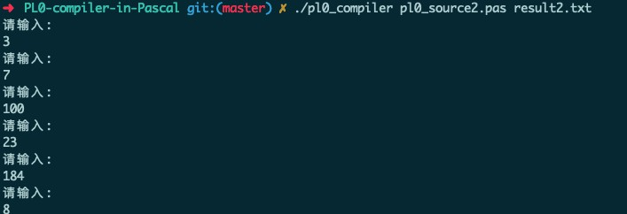

# 编译原理实验

Enviroment:

```bash
Free Pascal Compiler version 3.0.4 [2018/09/30] for x86_64
Copyright (c) 1993-2017 by Florian Klaempfl and others
Target OS: Darwin for x86_64
```

Usage:

`fpc pl0_compiler.pas`

`./pl0_compiler <pl0_src> <output>` 


## PL0语法

```
program = block "." .

block = [ "const" ident "=" number {"," ident "=" number} ";"]
        [ "var" ident {"," ident} ";"]
        { "procedure" ident ";" block ";" } statement .

statement = [ ident ":=" expression | "call" ident 
              | "?" ident | "!" expression 
              | "begin" statement {";" statement } "end" 
              | "if" condition "then" statement 
              | "while" condition "do" statement ].

condition = "odd" expression |
            expression ("="|"#"|"<"|"<="|">"|">=") expression .

expression = [ "+"|"-"] term { ("+"|"-") term}.

term = factor {("*"|"/") factor}.

factor = ident | number | "(" expression ")".
```

**PL/0** is a [programming language](https://en.wikipedia.org/wiki/Programming_language), intended as an [educational programming language](https://en.wikipedia.org/wiki/Educational_programming_language), that is similar to but much simpler than [Pascal](https://en.wikipedia.org/wiki/Pascal_(programming_language)), a [general-purpose programming language](https://en.wikipedia.org/wiki/General-purpose_programming_language). It serves as an example of how to construct a [compiler](https://en.wikipedia.org/wiki/Compiler). 

- 无实数类型
- 只有if和while流控制语句


## Pascal编译器学习

1. **机器语言** -- 为计算机CPU提供基本指令的实际二进制代码。这些通常是非常简单的命令，例如将两个数相加，或者把数据从内存中的某个位置移动到另外一个位置（寄存器）。
2. **汇编语言** -- 让人类能够直接为计算机编程而不用记忆二进制数字串的一种方法。汇编语言指令和机器代码一一对应。例如，在Intel x86架构的机器上，ADD和MOV分别是加法操作和移动操作的助记符。
3. **高级语言** -- 允许人类在编写复杂程序的时候不用一条指令一条指令地写。高级语言包括Pascal，C，C++，FORTRAN，Java，BASIC以及其它许多语言。高级语言中的一个命令，例如向文件中写入一个字符串，可能会翻译成几十甚至几百条机器语言指令。

微处理器只能够直接运行机器语言程序。汇编语言程序会被翻译成机器语言。同样地，用Pascal等高级语言写的程序也必须被转换为机器语言才能运行。这种转换就是编译。

完成这种转换的的程序就叫做**编译器**。这种程序相当复杂，因为它不仅要根据一行行的代码创建机器语言指令，经常还要优化代码让它运行得更快，添加差错校验码，并且还要将这个代码跟存放在别处的子程序链接起来。**例如，当你叫计算机打印一些东西到屏幕上的时候，编译器把这个命令转换成对一个事先写好的模块的调用。然后你的代码必须被链接到编译器开发商提供的代码才能产生一个可执行程序。**


在高级语言中，有三个基本术语：

1. 源代码 --Pascal源代码文件通常以"`.pas`"或者"`.pp`"作为后缀。
2. 目标代码 -- 编译的结果。目标代码通常程序的一个模块，而且由于它不完整，它还不能运行。在DOS/Windows系统中，这种文件通常的后缀名是"`.obj`"
3. 可执行代码 -- 最终的结果。一个程序起能够运行起来所需要的所有的目标代码模块都被链接到一起。在DOS/Windows系统中，这种文件的后缀通常是"`.exe`"


## 对原PL0编译程序的修改之处

1. 在getsym词法分析程序中增加对">"，"<"，">="，"<="，"<>"的识别

```pascal
    else if ch = '<' {处理'<'}
           then begin	
                   getch;	
                   if ch = '='	
                   then begin
                           sym := leq;	{表示小于等于}
                           getch	{读下一个字符}
                       end
                   else if ch = '>' {处理'>'}
                   then begin
                           sym := neq;	{表示不等于}
                           getch
                       end
                   else sym := lss	{表示小于}
               end
   
           else if ch = '>' {处理'<'}
           then begin	
                   getch;	
                   if ch = '='	
                   then begin
                           sym := geq;	{表示大于等于}
                           getch	{读下一个字符}
                       end
                   else sym := gtr	{表示大于}
               end
```


2. 由于使用go会编译报错，故当读到文件末尾的时候直接关闭文件并结束程序。

```
Goto statements are not allowed between different procedures
```

```pascal
if eof(file_in) {如果已到文件尾} 
then begin 
    write(file_out,'PROGRAM INCOMPLETE'); {报错}
    close(file_in);	
    close(file_out);{关闭文件}
    exit; {退出}
end; 
```

3. input为pl0源文件文件名，output为输出文件名

   - 在主程序增加文件操作
   - write和read中的标准输入输出改为文件输入输出。

```pascal
{增加全局变量定义}
file_in : text;    {源代码文件}      
file_out :  text;  {输出文件}
...

begin  {主程序}
 	assign(file_in,paramstr(1));
    assign(file_out,paramstr(2));	{将文件名字符串变量赋值给文件变量}
    reset(file_in);
    rewrite(file_out);	{打开文件}
	...
	close(file_in);	
    close(file_out);	{关闭文件}
end.
```

```pascal
 {读新的一行} 
 ll := 0; 
 cc := 0; 
 write(file_out,cx : 5, ' '); {cx : 5 位数,输出代码地址，宽度为5} 
 while not eoln(file_in) do {如果不是行末} 
 begin 
     ll := ll + 1; {将行缓冲区的长度+1}
     read(file_in,ch);	{从文件中读取一个字符到ch中}
     write(file_out,ch); {控制台输出ch}
     line[ll] := ch {把这个字符放到当前行末尾}
 end; 
 writeln(file_out); {换行}
 readln(file_in);	{源文件读取从下一行开始}
 ll := ll + 1; {将行缓冲区的长度+1}
 line[ll] := ' ' { process end-line }	{行数组最后一个元素为空格}
...
```

第一步结果：


PL0源程序：

```pascal
const m = 7, n = 85; 

var x, y, z, q, r; 

procedure multiply; 
    var a, b; 
    begin 
        a := x; 
        b := y; 
        z := 0;
        while b > 0 do 
        begin 
            if odd b then z := z + a; 
                a := 2*a ; b := b/2 ; 
        end
    end;
    
procedure divide; 
    var w; 
    begin r := x; q := 0; w := y; 
    while w <= r do 
        w := 2*w; 
        while w > y do
        begin 
            q := 2*q; 
            w := w/2; 
            if w <= r then 
            begin 
                r := r-w; 
                q := q+1 
            end 
        end
    end;

procedure gcd;
    var f, g ; 
    begin 
        f := x; 
        g := y; 
        while f <> g do 
        begin 
            if f < g then 
                g := g-f; 
            if g < f then 
                f := f-g; 
        end; 
        z := f 
    end;

begin  
    x := m; y := n; call multiply;
    x := 25; y := 3; call divide;
    x := 84; y:= 36; call gcd; 
end.
```

输出结果，包括：

- 输入的pl0源文件的字符
- 生成的助记符（汇编指令）
- 数据栈顶的运行结果（START PL/0 END PL/0之间）

```
    0 const m = 7, n = 85; 
    1 
    1 var x, y, z, q, r; 
    1 
    1 procedure multiply; 
    1     var a, b; 
    2     begin 
    3         a := x; 
    5         b := y; 
    7         z := 0;
    9         while b > 0 do 
   13         begin 
   13             if odd b then z := z + a; 
   20                 a := 2*a ; b := b/2 ; 
   28         end
   28     end;
    2  INT    0    5
    3  LOD    1    3
    4  STO    0    3
    5  LOD    1    4
    6  STO    0    4
    7  LIT    0    0
    8  STO    1    5
    9  LOD    0    4
   10  LIT    0    0
   11  OPR    0   12
   12  JPC    0   29
   13  LOD    0    4
   14  OPR    0    6
   15  JPC    0   20
   16  LOD    1    5
   17  LOD    0    3
   18  OPR    0    2
   19  STO    1    5
   20  LIT    0    2
   21  LOD    0    3
   22  OPR    0    4
   23  STO    0    3
   24  LOD    0    4
   25  LIT    0    2
   26  OPR    0    5
   27  STO    0    4
   28  JMP    0    9
   29  OPR    0    0
   30     
   30 procedure divide; 
   30     var w; 
   31     begin r := x; q := 0; w := y; 
   38     while w <= r do 
   42         w := 2*w; 
   47         while w > y do
   51         begin 
   51             q := 2*q; 
   55             w := w/2; 
   59             if w <= r then 
   62             begin 
   63                 r := r-w; 
   67                 q := q+1 
   69             end 
   71         end
   71     end;
   31  INT    0    4
   32  LOD    1    3
   33  STO    1    7
   34  LIT    0    0
   35  STO    1    6
   36  LOD    1    4
   37  STO    0    3
   38  LOD    0    3
   39  LOD    1    7
   40  OPR    0   13
   41  JPC    0   47
   42  LIT    0    2
   43  LOD    0    3
   44  OPR    0    4
   45  STO    0    3
   46  JMP    0   38
   47  LOD    0    3
   48  LOD    1    4
   49  OPR    0   12
   50  JPC    0   72
   51  LIT    0    2
   52  LOD    1    6
   53  OPR    0    4
   54  STO    1    6
   55  LOD    0    3
   56  LIT    0    2
   57  OPR    0    5
   58  STO    0    3
   59  LOD    0    3
   60  LOD    1    7
   61  OPR    0   13
   62  JPC    0   71
   63  LOD    1    7
   64  LOD    0    3
   65  OPR    0    3
   66  STO    1    7
   67  LOD    1    6
   68  LIT    0    1
   69  OPR    0    2
   70  STO    1    6
   71  JMP    0   47
   72  OPR    0    0
   73 
   73 procedure gcd;
   73     var f, g ; 
   74     begin 
   75         f := x; 
   77         g := y; 
   79         while f <> g do 
   83         begin 
   83             if f < g then 
   86                 g := g-f; 
   91             if g < f then 
   94                 f := f-g; 
   99         end; 
  100         z := f 
  101     end;
   74  INT    0    5
   75  LOD    1    3
   76  STO    0    3
   77  LOD    1    4
   78  STO    0    4
   79  LOD    0    3
   80  LOD    0    4
   81  OPR    0    9
   82  JPC    0  100
   83  LOD    0    3
   84  LOD    0    4
   85  OPR    0   10
   86  JPC    0   91
   87  LOD    0    4
   88  LOD    0    3
   89  OPR    0    3
   90  STO    0    4
   91  LOD    0    4
   92  LOD    0    3
   93  OPR    0   10
   94  JPC    0   99
   95  LOD    0    3
   96  LOD    0    4
   97  OPR    0    3
   98  STO    0    3
   99  JMP    0   79
  100  LOD    0    3
  101  STO    1    5
  102  OPR    0    0
  103 
  103 begin  
  104     x := m; y := n; call multiply;
  109     x := 25; y := 3; call divide;
  114     x := 84; y:= 36; call gcd; 
  119 end.
  103  INT    0    8
  104  LIT    0    7
  105  STO    0    3
  106  LIT    0   85
  107  STO    0    4
  108  CAL    0    2
  109  LIT    0   25
  110  STO    0    3
  111  LIT    0    3
  112  STO    0    4
  113  CAL    0   31
  114  LIT    0   84
  115  STO    0    3
  116  LIT    0   36
  117  STO    0    4
  118  CAL    0   74
  119  OPR    0    0
START PL/0
END PL/0
```


## 扩展Read和Write语句

1. 首先增加保留字表中的条目，并将保留字的个数增加到13个，注意因为记号的长度为10，不足则补空格

   ```pascal
   norw = 13; {保留字的个数} 
   al = 10; {记号的长度} 
   
   word[1]  := 'begin     '; word[2]  := 'call      ';
   word[3]  := 'const     '; word[4]  := 'do        ';
   word[5]  := 'end       '; word[6]  := 'if        ';
   word[7]  := 'odd       '; word[8]  := 'procedure ';
   word[9]  := 'read      '; word[10] := 'then      '; 
   word[11] := 'var       '; word[12] := 'while     '; 
   word[13] := 'write     '; {保留字表改为小写字母,所有字符都预留的相同的长度}
   ```

2. 增加symbol记号中的定义，用于对read和write词法分析，并增加read和write保留字对应的记号

   ```pascal
   symbol = (...,writesym,readsym)
   
   wsym[1] := beginsym;   wsym[2] := callsym;
   wsym[3] := constsym;   wsym[4] := dosym;
   wsym[5] := endsym;     wsym[6] := ifsym;
   wsym[7] := oddsym;     wsym[8] := procsym;
   wsym[9] := readsym     wsym[10] := thensym;    
   wsym[11] := varsym;    wsym[12] := whilesym;  
   wsym[13] := writesym; {保留字对应的记号,添加read和write的保留字记号}
   ```

3. pl0中的语句可以以read或者write开始

   ```pascal
   statbegsys := [beginsym, callsym, ifsym, whilesym , writesym, readsym]; {语句的开始符号}
   ```

4. 增加助记符RED和WRT

   ```
   mnemonic[lit] := 'LIT  ';    mnemonic[opr] := 'OPR  ';
   mnemonic[lod] := 'LOD  ';    mnemonic[sto] := 'STO  ';
   mnemonic[cal] := 'CAL  ';    mnemonic[int] := 'INT  ';
   mnemonic[jmp] := 'JMP  ';    mnemonic[jpc] := 'JPC  '; 
   mnemonic[red] := 'RED  ';    mnemonic[wrt] := 'WRT  ';{中间代码指令的字符串，长度为5}
   ```

5. 增加文法分析程序中语句procedure对保留字read和write的处理

   - 合法的read则生成gen(red,lev-level,adr)指令
   - 合法的write则生成gen(wrt,0,0)指令

   ```pascal
    else if sym = readsym	{处理read关键字} then 
    begin
        getsym;	{获取下一个sym类型}
        if sym = lparen	{read的后面应该接左括号} 
        then begin
            repeat	{循环开始}
                getsym;	{获取下一个sym类型}
                if sym = ident	{如果第一个sym标识符}
                then begin	
                    i := position(id);	{记录当前符号在符号表中的位置}
                    if i = 0	{如果i为0,说明符号表中没有找到id对应的符号}
                    then error(11)	{报11号错误}
                    else if table[i].kind <> variable {如果找到了,但该符号的类型不是变量}
                    then begin
                    error(12);	{报12号错误,不能像常量和过程赋值}
                    i := 0	{将i置零}
                end
                else with table[i] do	{如果是变量类型}
                		gen(red,lev-level,adr)	{生成一条red指令,读取数据}
                end
                else error(4);	{如果左括号后面跟的不是标识符,报4号错误}
                getsym;	{获取下一个sym类型}
            until sym <> comma	{直到符号不是逗号,循环结束}
        end
        else error(40);	{如果read后面跟的不是左括号,报40号错误}
        if sym <> rparen	{如果上述内容之后接的不是右括号}
        then error(22);	{报22号错误}
        getsym	{获取下一个sym类型}
    end
   
   else if sym = writesym	{处理write关键字} then 
   begin
       getsym;	{获取下一个sym类型}
       if sym = lparen	{默认write右边应该加一个左括号}
       then begin
           repeat	{循环开始}
               getsym;	{获取下一个sym类型}
               expression([rparen,comma]+fsys);	{分析括号中的表达式}
               gen(wrt,0,0);	{生成一个wrt，用来输出内容}
               until sym <> comma;	{知道读取到的sym不是逗号}
               if sym <> rparen	{如果内容结束没有右括号}
               then error(22);	{报22号错误}
           getsym	{获取下一个sym类型}
       end
       else error(40)	{如果write后面没有跟左括号}
   end;
   ```

6. 在interpret解释执行程序中加入对red和wrt指令的寄存器和输入输出操作

   ```pascal
   red : begin	{对red指令}
       writeln('请输入: ');	{输出提示信息到标准输出屏幕上}
       readln(s[base(l)+a]); {读一行数据,读入到相差l层,层内偏移为a的数据栈中的数据的信息}
   end;
   
   wrt : begin	{对wrt指令}
       writeln(file_out,s[t]);	{输出栈顶的信息}
       t := t+1	{栈顶上移}
   end
   ```


为PL0源程序增加输入输出语句

```pascal
const m = 7, n = 85; 

var x, y, z, q, r, z1; 

procedure multiply; 
    var a, b; 
    begin 
        a := x; 
        b := y; 
        z := 0;
        while b > 0 do 
        begin 
            if odd b then z := z + a; 
                a := 2*a ; b := b/2 ; 
        end
    end;
    
procedure divide; 
    var w; 
    begin r := x; q := 0; w := y; 
    while w <= r do 
        w := 2*w; 
        while w > y do
        begin 
            q := 2*q; 
            w := w/2; 
            if w <= r then 
            begin 
                r := r-w; 
                q := q+1 
            end 
        end
    end;

procedure gcd;
    var f, g ; 
    begin 
        f := x; 
        g := y; 
        while f <> g do 
        begin 
            if f < g then 
                g := g-f; 
            if g < f then 
                f := f-g; 
        end; 
        z := f 
    end;

begin
    read(x,y);
    call multiply;
    z1 := z;
    read(x,y);
    call divide;
    read(x,y);
    call gcd;
    write(z1,q,r,z);
    write((q+r)*z1/z);
end.
```


输出的运行结果



```pascal
..
START PL/0
21 {z1}
4  {q}
8  {r}
8  {z}
31 {(q+r)*z1/z}
END PL/0
```

产生的中间代码

```
    1 
    {源码略去}
    2  INT    0    5
    3  LOD    1    3
    4  STO    0    3
    5  LOD    1    4
    6  STO    0    4
    7  LIT    0    0
    8  STO    1    5
    9  LOD    0    4
   10  LIT    0    0
   11  OPR    0   12
   12  JPC    0   29
   13  LOD    0    4
   14  OPR    0    6
   15  JPC    0   20
   16  LOD    1    5
   17  LOD    0    3
   18  OPR    0    2
   19  STO    1    5
   20  LIT    0    2
   21  LOD    0    3
   22  OPR    0    4
   23  STO    0    3
   24  LOD    0    4
   25  LIT    0    2
   26  OPR    0    5
   27  STO    0    4
   28  JMP    0    9
   29  OPR    0    0
   30     
   {源码略去}
   31  INT    0    4
   32  LOD    1    3
   33  STO    1    7
   34  LIT    0    0
   35  STO    1    6
   36  LOD    1    4
   37  STO    0    3
   38  LOD    0    3
   39  LOD    1    7
   40  OPR    0   13
   41  JPC    0   47
   42  LIT    0    2
   43  LOD    0    3
   44  OPR    0    4
   45  STO    0    3
   46  JMP    0   38
   47  LOD    0    3
   48  LOD    1    4
   49  OPR    0   12
   50  JPC    0   72
   51  LIT    0    2
   52  LOD    1    6
   53  OPR    0    4
   54  STO    1    6
   55  LOD    0    3
   56  LIT    0    2
   57  OPR    0    5
   58  STO    0    3
   59  LOD    0    3
   60  LOD    1    7
   61  OPR    0   13
   62  JPC    0   71
   63  LOD    1    7
   64  LOD    0    3
   65  OPR    0    3
   66  STO    1    7
   67  LOD    1    6
   68  LIT    0    1
   69  OPR    0    2
   70  STO    1    6
   71  JMP    0   47
   72  OPR    0    0
   73 
   {源码略去}
   74  INT    0    5
   75  LOD    1    3
   76  STO    0    3
   77  LOD    1    4
   78  STO    0    4
   79  LOD    0    3
   80  LOD    0    4
   81  OPR    0    9
   82  JPC    0  100
   83  LOD    0    3
   84  LOD    0    4
   85  OPR    0   10
   86  JPC    0   91
   87  LOD    0    4
   88  LOD    0    3
   89  OPR    0    3
   90  STO    0    4
   91  LOD    0    4
   92  LOD    0    3
   93  OPR    0   10
   94  JPC    0   99
   95  LOD    0    3
   96  LOD    0    4
   97  OPR    0    3
   98  STO    0    3
   99  JMP    0   79
  100  LOD    0    3
  101  STO    1    5
  102  OPR    0    0
  {源码略去}
  103  INT    0    9
  104  RED    0    3
  105  RED    0    4
  106  CAL    0    2
  107  LOD    0    5
  108  STO    0    8
  109  RED    0    3
  110  RED    0    4
  111  CAL    0   31
  112  RED    0    3
  113  RED    0    4
  114  CAL    0   74
  115  LOD    0    8
  116  WRT    0    0
  117  LOD    0    6
  118  WRT    0    0
  119  LOD    0    7
  120  WRT    0    0
  121  LOD    0    5
  122  WRT    0    0
  123  LOD    0    6
  124  LOD    0    7
  125  OPR    0    2
  126  LOD    0    8
  127  OPR    0    4
  128  LOD    0    5
  129  OPR    0    5
  130  WRT    0    0
  131  OPR    0    0
```

